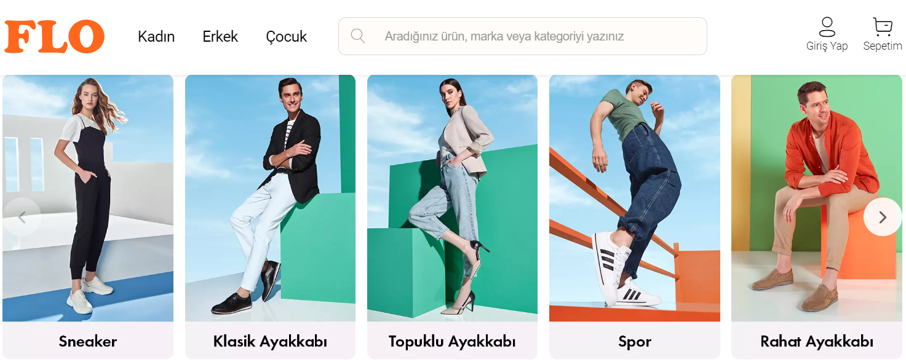

# Unsupervised-Learning-with-Customer-Segmentation

 

## Business Problem

FLO Retailing, an online shoe store, wants to divide its customers into segments and determine marketing strategies according to these segments. To this end, customers' behaviors will be defined and groups will be created based on clusters in these behaviors.

## Dataset Story

The data set consists of information obtained from the past shopping behavior of customers who made their last purchases via OmniChannel (both online and offline shopping) in 2020 - 2021.

## Features of Dataset

- **Total Features :** 12
- **Total Row :** 19.945
- **CSV File Size:** 2.7 MB

## Variable Descriptions

**master_id:** Unique customer number

**order_channel:** Which channel of the shopping platform used (Android, iOS, desktop, mobile)

**last_order_channel:** Channel where the last shopping was made

**first_order_date:** Customer's first shopping date

**last_order_date:** Customer's latest shopping date

**last_order_date_online:** Customer's latest shopping date on the online platform

**last_order_date_offline:** Customer's latest shopping date on offline platform

**order_num_total_ever_online:** Customer's total number of shopping on the online platform

**order_num_total_ever_offline:** Customer's total number of shopping on the offline platform

**customer_value_total_ever_offline:** Total fee paid by the customer in offline shopping

**customer_value_total_ever_online:** Total fee paid by the customer in online shopping

**interested_in_categories_12:** List of categories where the customer shopping in the last 12 months
